% 75.74 Sistemas Distribuidos I - Trabajo Práctico N°2
% Donato, Juan Pablo. Padrón 100839
% Nov 2nd, 2021

\begin{center} 
\includegraphics[]{imagenes/logo.jpg}
\end{center}

# Informe - Introduccion

El presente informe tiene como objetivo presentar las caracteristicas mas relevantes del Trabajo Práctico N°2 denominado **Middleware y Coordinación de Procesos**.

El trabajo consiste en el desarrollo de un sistema de arquitectura *Pipe & Filters*, donde se deben procesar un set de datos de preguntas y respuestas de *Stack Overflow* utilizando filtros que ejecutan determinadas operaciones en los datos, comunicandolos mediante colas de **RabbitMQ**.

A continuacion se presentará el trabajo en las siguientes vistas:

- Contexto
- Componentes
- Fisico
- Desarrollo

## Contexto

Como se detalló en la introducción, el trabajo consistió en desarrollar una arquitectura *Pipe & Filters* para resolver un problema donde, teniendo un set de datos muy grande como entrada, procesar datos para obtener un resultado final sobre algúna problematica. En esta oportunidad, teniamos que resolver tres problemas:

1. Porcentaje de respuestas con score mayor a 10 que posea un sentiment analysis negativo
2. Top 10 de usuarios según score total (preguntas + respuestas), que tengan un puntaje promedio de preguntas mayor a la media general y un puntaje promedio de respuestas mayor a la media general
3. Top 10 de tags con mayor score (incluye preguntas y respuestas) de cada año

Cada uno de estos puntos, si bien toman como input datos del mismo set de datos, son de dificultad variada, lo que impone un desafio aún mayor a la hora de resolver este trabajo.

Para encarar la solución, se realizó un DAG por cada uno de los puntos para detectar tareas a realizar y oportunidades de realizar algunas de ellas en paralelo. Comenzando con el punto 1:

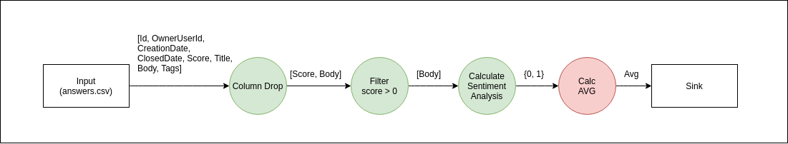

Este primer punto es el que menor dificultad presenta, por lo que el DAG que se presenta es bastante "lineal". En él vemos:

- Necesitamos una tarea inicial para "inyectar" los datos de las respuestas de Stack Overflow
- Se debe realizar cuanto antes en el flujo de datos una tarea de "remover columnas innecesarias" para el proceso, para lograr disminuir la cantidad de datos que se manipulan entre etapas y no perjudicar a la memoria de cada sistema.
- Una vez consideradas las primeras tareas de preparación, se procede a resolver la problematica que plantea este ejercicio. Para eso, debemos filtrar cada respuesta donde `Score > 0`
- Posteriormente, a aquellas que pasen este filtro, se calculará el Sentiment Analysis (SA) del contenido de la respuesta para distinguir aquellas que tengan SA positivo (1) de aquellas que tengan SA negativo (0).
- Por último, se debe contabilizar el porcentaje de aquellas que cumplan con el primer filtro y que tengan SA negativo, sobre el total. En esta etapa es importantisimo esperar a la confirmación de la etapa anterior de que se hayan procesado **todos** los datos antes de devolver un resultado final.

Ahora consideremos el punto 3, para aumentar apenas un poco la dificultad:

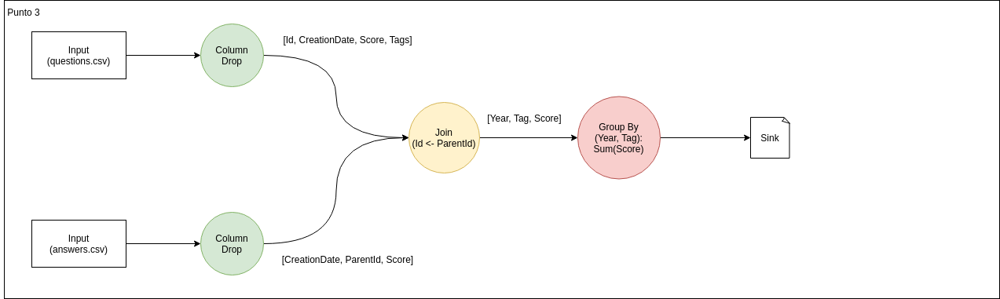

- Volvemos a necesitar las primeras dos etapas por los mismos motivos que el punto anterior, pero ahora considerando ambos tipos de datos y cambiando las columnas necesarias en este proceso.
- Debemos tener una etapa que pueda unir o "joinear" datos de preguntas y respuestas a medida que los va consumiendo, de forma tal de extraer año, tags y puntaje para cada pregunta o respuesta del set de datos, teniendo en cuenta que los "tags" son parte de la tabla de preguntas. Si esta etapa descubre una respuesta a la cuál no posea la pregunta correspondiente para extraer esta data, deberá mantenerla en memoria hasta tanto reciba dicho dato faltante para no perder información valiosa.
- Finalmente, necesitamos de una etapa final que se encargue de armar el resultado final a medida que reciba año, tags y puntajes de la etapa anterior. Deberá devolver un resultado final sólo cuando se hayan procesado absolutamente todos los datos del dataset.

Por último, revisemos las tareas pertinentes al punto de mayor dificultad de los tres planteados, el punto 2:

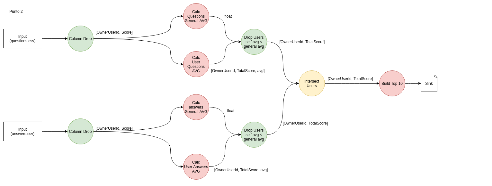

- Al igual que los dos puntos anteriores, necesitamos inyectar datos y descartar informacion que no vayamos a utilizar.
- Por cada pregunta y por cada respuesta, se debe:
  - Calcular el promedio de Score *de un usuario* de todas sus preguntas/respuestas.
  - Calcular el promedio de Score *global* de todas las preguntas/respuestas.
- Una vez determinados estos valores, se deben filtrar aquellos usuarios que cumplan ambas siguientes condiciones: estar por arriba del promedio de Score de preguntas y de respuestas
- Por último, necesitamos una etapa que vaya armando el Top 10 de usuarios con más score, que cumplan con la condicion detallada en el item anterior.


Como conclusión de esta vista, podemos ver que el problema puede ser resuelto totalmente bajo un diseño "pipe & filters", haciendo atravezar los datos por distintos filtros que aplicarán determinadas acciones sobre ellos de analisis y alteración para finalmente obtener los resultados solicitados. También podemos ver de los DAGs que varias de estas etapas podrían paralelizarse, e incluso tener uno o más componentes efectuando *la misma tarea* sobre un dato, teniendo cuidado con ciertos aspectos como la afinidad de los datos, que fue un desafio lograr y que será detallado en las vistas siguientes.

----------------

## Primer Punto

La consigna del primer punto es:

```text
Porcentaje de respuestas con score mayor a 10 que posea un sentiment analysis negativo
```

Para implementar este punto, realicé el siguiente DAG para poder visualizar mejor las tareas necesarias a realizar:


Podemos ver el flujo de datos desde la entrada a la salida, con el formato que debe tener entre etapas. Ademas, según el color de cada etapa:

- Verde: la etapa puede recibir un dato, procesarlo, y otorgar una salida, sin esperar que la etapa previa finalice (lo llamaremos *operator*)
- Rojo: la etapa recibe datos, los procesa, pero no otorga una salida hasta que la o las etapas previas finalicen en su totalidad (los llamaremos *holders*).

Teniendo en cuenta este DAG, se realiza un diagrama de robustez que muestra los distintos componentes a ser empleados para la resolución de este punto.

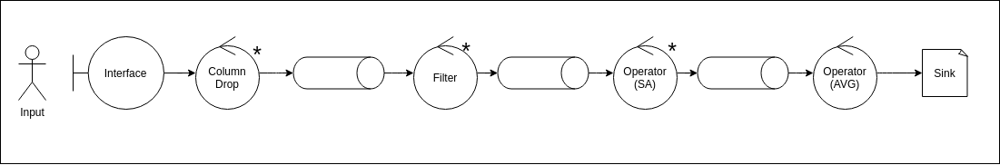

Como vemos, todos los componentes *operators* son **escalables**, y el último componente será el único que se mantendrá como único en su tipo. La comunicacion etapa a etapa se dará por colas de RabbitMQ *comunes*, a las que llamaremos *patron work_queue*.

## Segundo Punto

Para el segundo punto, la consigna fue:

```text
Top 10 de usuarios según score total (preguntas + respuestas), que tengan un puntaje promedio de preguntas mayor a la media general y un puntaje promedio de respuestas mayor a la media general
```

Para este caso (el más complejo de los tres), el DAG es el siguiente:


Como vemos, ahora tenemos dos inputs de datos distintos, y los flujos se vuelven un poco mas "bifurcados". Para eso, formulé el siguiente esquema:

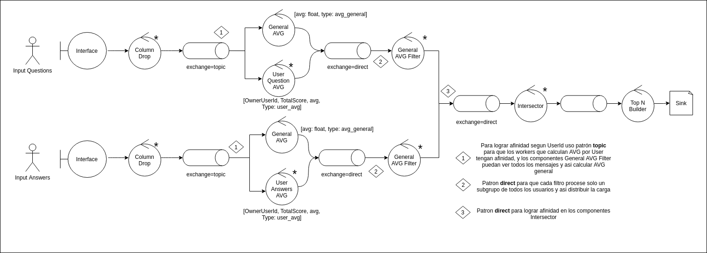

En este nuevo diagrama, los puntos mas relevantes son:

- La aparicion de nuevos esquemas o **patrones** de colas de RabbitMQ que serviran para, ademas de intercomunicar filtros, darle afinidad a los datos, de forma de distribuirlos en multiples nodos de una misma etapa a partir de una clave de hashing básica (como tomar el módulo de un dato númerico). Entre estos pátrones, estan:
  - **Direct**: nos servirá para darle afinidad a los datos y de esta forma distribuirlos en multiples nodos de una misma etapa por una clave de hashing básica de uno de los datos (como tomar el módulo de un dato númerico).
  - **Topic**: nos servirá para darle afinidad a los datos para llegar a los componentes denominados *User Question AVG* pero además permitirá al componente *General AVG* recibir la totalidad de los mensajes de esa cola para calcular el promedio global.
- La aparición de un nuevo componente (*partial operator*) en amarillo, el cuál recibe datos para procesarlos, generando una salida únicamente si ha recibido los datos necesarios para hacerlo.

## Punto tres

En éste último punto, la consigna fue:

```text
Top 10 de tags con mayor score (incluye preguntas y respuestas) de cada año
```

Para esto, se formula el siguiente DAG, teniendo en cuenta las consideraciones de los puntos anteriores:


Este punto de dificultad intermedia entre los dos primeros puntos comparte el esquema de multiples inputs de datos. Para implementar esto, me guíe del siguiente diagrama de robustez:

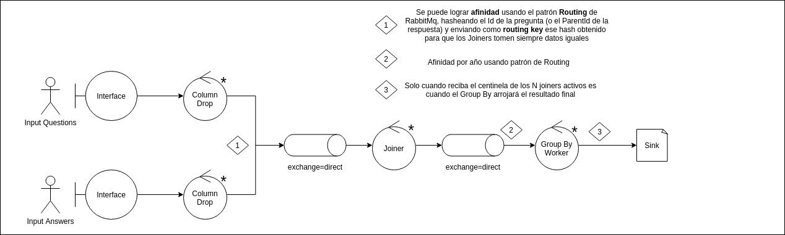

En este caso tambien utilizacé el patrón **direct** para poder lograr afinidad de los datos al escalar los distintos componentes del flujo.

## Estructura global

La división punto por punto me fue útil para diferenciar el trabajo y el alcance de cada etapa. Pero la consigna implica que el sistema pueda hacer estos tres flujos, *de forma simultanea*. Si juntamos los tres esquemas, logramos algo como esto:

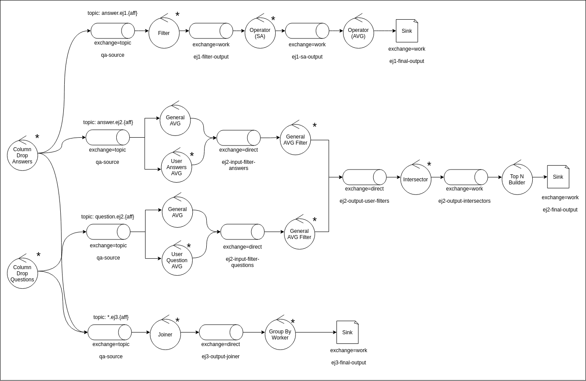

La principal diferencia al unir los tres esquemas está en el componente que **elimina columnas dado el flujo que deban seguir los datos**. En este caso, dicho componente toma un input de los datos, y según la etapa, encola en la cola correspondiente las columnas que cada flujo necesita en su operatoria, utilizando el patrón **topic**. De esta forma, estos componentes pueden:

\begin{itemize}
    \item Procesar no una linea a la vez, sino un *chunk* de cada archivo de data inicial, y ofrecer como salida un *chunks* de datos

    \item Publicar mediante un exchange **topic** los datos en cada flujo, con las columnas que deban tomarse

    \item Lograr afinidad en los datos en aquellos *front components* de cada flujo que estuvieran replicados
\end{itemize}

## Esquema del sistema

El desarrollo del trabajo está **muy orientado a la configuración de cada componente**. Esto quiere decir que cada componente recibe una cantidad (considerable) de parámetros que definirán su comportamiento, cargando todos en dos tipos de bloques: *operator* y *holder*, segun su comportamiento. Esto nos permite:

\begin{itemize}
    \item Poder agregar nuevos componentes con nuevas funcionalidades de forma rápida

    \item Cambiando solamente las configuraciones adecuadas, poder adaptar y escalar nuestro sistema
\end{itemize}

### Listado de configuraciones y variables de ambiente
\begin{itemize}

    \item OPERATOR\_MODULE: Define el tipo de operador del bloque al que se asigna (ej: Operador que calcula el Sentiment Analysis del primer punto)

    \item OPERATOR\_PARAMS: Parámetro en formato JSON que define los argumentos que toma cada operador

    \item INPUT\_QUEUE\_PARAMS: Parametro en formato JSON que define el formato de queue de entrada al bloque. Incluye:

        \begin{itemize}
            \item pattern: Patron de RabbitMQ (work\_queue, direct o topic)

            \item queue\_name o exchange\_name: Nombre de la cola o exchange a conectarse

            \item routing\_key: Clave de ruteo a utilizar
        \end{itemize}

        

    \item OUTPUT\_QUEUE\_PARAMS: Parametro en formato JSON que define el formato de queue de salida al bloque. Incluye los mismos campos que su par INPUT\_QUEUE\_PARAMS

    \item CENTINELS\_TO\_RECEIVE: Cantidad de centinelas (mensajes 'END') a recibir de la etapa previa para considerarla como finalizada. Considera la cantidad de componentes de la o las etapas previas que estuvieran "conectados" al componente actual.

    \item CENTINELS\_TO\_SEND: Cantidad de centinelas a enviar a la etapa posterior para simbolizar la finalización del procesamiento del componente actual. Toma en cuenta la cantidad de componentes que existen en la etapa posterior.

\end{itemize}

De esta forma, por ejemplo en el punto 3 podemos agregar un nuevo **joiner** en la entrada de la siguiente forma:


```yaml
ej3-joiner-1:
    container_name: ej3-joiner-1
    image: building-block:latest
    environment: 
      - PYTHONUNBUFFERED=1
      - OPERATOR_MODULE=operators.joiner
      - OPERATOR_PARAMS={"perform_affinity":true,"affinity_key":"Year",
      "affinity_divider":2}
      - INPUT_QUEUE_PARAMS={"pattern":"topic","exchange_name":"qa-source",
      "routing_key":"*.ej3.0"}
      - OUTPUT_QUEUE_PARAMS={"pattern":"direct","exchange_name":"ej3-output-joiner"}
      - CENTINELS_TO_RECEIVE=5
      - CENTINELS_TO_SEND=2
    depends_on:
      - "rabbitmq-tp2"
    command: ["./wait-for", "rabbitmq-tp2:5672", "--", "python", "basic_operator.py"]
    networks:
      - tp2-network
```

De esta forma, estamos diciendole al nuevo bloque que:

- Es el tipo `operators.joiner`
- Como parámetros del operador:
  - Debe realizar afinidad de los datos en la salida
  - La llave de afinidad es el campo `Year`
  - La clave de hashing implica tomar el resto por 2. Esto se debe a que la siguiente etapa posee dos componentes posibles para procesar la salida de este operador.
- Como cola de entrada
  - Patron "Topic"
  - El nombre del exchange a conectarse es `qa-source`
  - La clave de ruteo que debe contener el mensaje que salga de dicho exchange es `*.ej3.0`. Esto significa coloquialmente *"quiero recibir todos los mensajes (preguntas o respuestas) del ejercicio 3, cuya afinidad de datos sea 0"*. Otra clave de ruteo podria ser `answer.ej2.1`, traducida *"quiero todas los datos de tipo respuestas del ejercicio 2 cuya clave de afinidad sea 1"*.
- Como cola de salida
  - Patron "Direct"
  - Nombre del exchange de salida `ej2-input-filter-answers`
- Debe esperar la recepcion de 3 centinelas de la etapa anterior para darse como finalizada.
- Debe enviar 2 centinelas (a cada clave de afinidad entre 0 y *affinity_divider*) a la siguiente etapa para informar que ha finalizado.

Notar en el campo `command` el comando `\wait-for` para esperar por la inicializacion de RabbitMQ para ejecutar nuestro bloque, y el llamado a `basic_operator.py` indicando que nuestro componente es un *operator*.

# Diagrama C4
## Level 1
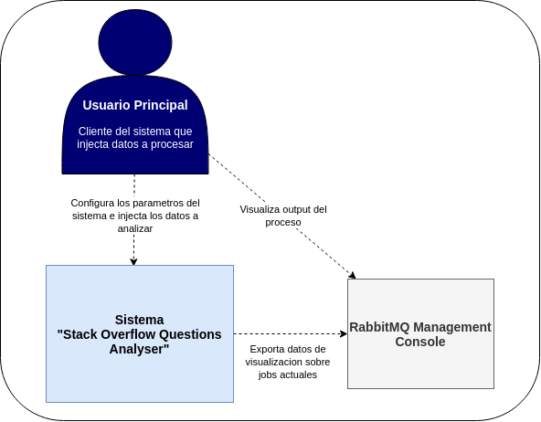

\newpage

## Level 2


## Level 3
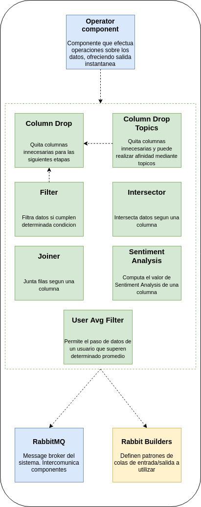

\newpage

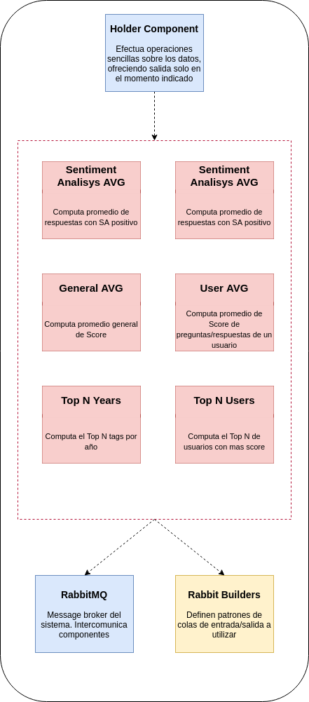

\newpage

## Level 4
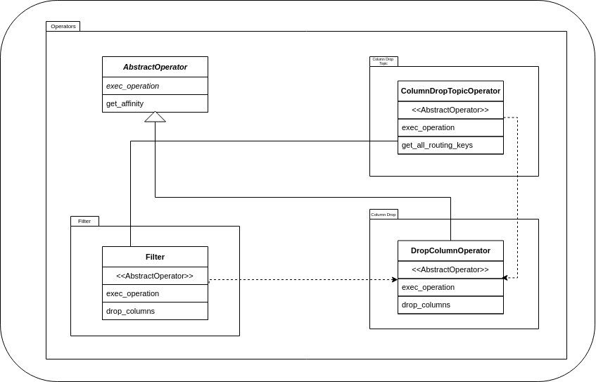
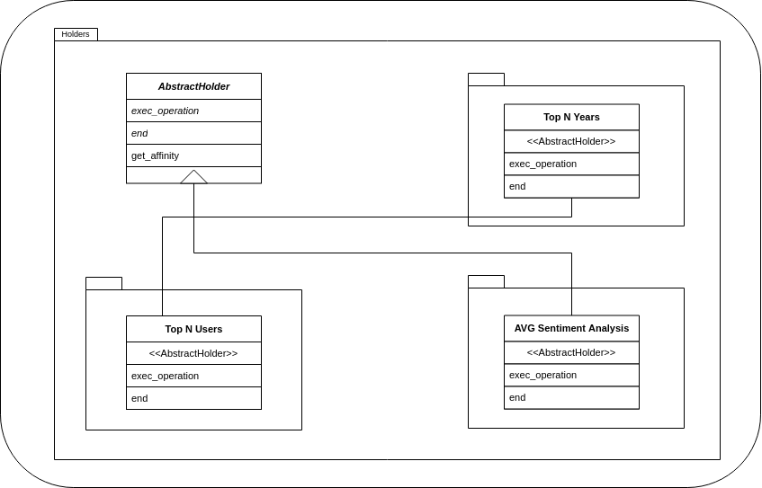