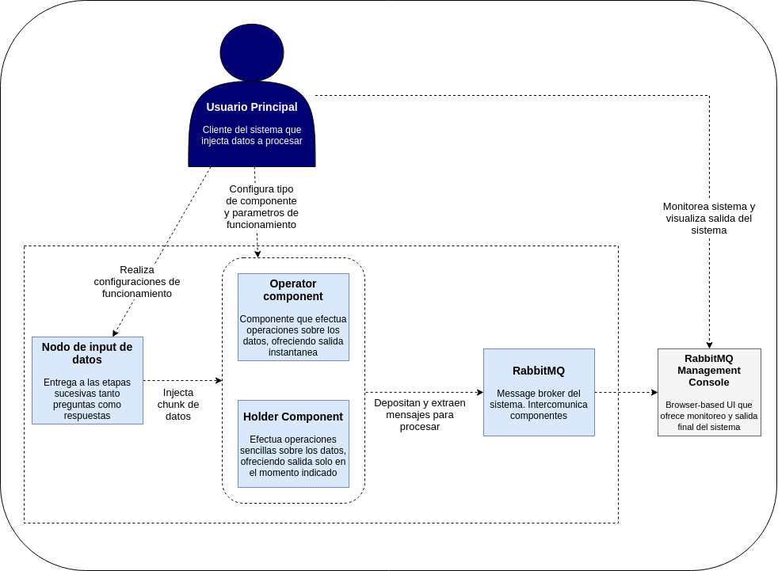

% 75.74 Sistemas Distribuidos I - Trabajo Práctico N°2
% Donato, Juan Pablo. Padrón 100839
% Nov 2nd, 2021

\begin{center} 
\includegraphics[]{imagenes/logo.jpg}
\end{center}

# Informe - Introduccion

El presente informe tiene como objetivo presentar las caracteristicas mas relevantes del Trabajo Práctico N°2 denominado **Middleware y Coordinación de Procesos**.

El trabajo consiste en el desarrollo de un sistema de arquitectura *Pipe & Filters*, donde se deben procesar un set de datos de preguntas y respuestas de *Stack Overflow* utilizando filtros que ejecutan determinadas operaciones en los datos, comunicandolos mediante colas de **RabbitMQ**.

A continuacion se presentará el trabajo en las siguientes vistas:

- Contexto
- Fisica
- Componentes
- Desarrollo

## Vista de Contexto

Como se detalló en la introducción, el trabajo consistió en desarrollar una arquitectura *Pipe & Filters* para resolver un problema donde, teniendo un set de datos muy grande como entrada, procesar datos para obtener un resultado final sobre algúna problematica. En esta oportunidad, teniamos que resolver tres problemas:

1. Porcentaje de respuestas con score mayor a 10 que posea un sentiment analysis negativo
2. Top 10 de usuarios según score total (preguntas + respuestas), que tengan un puntaje promedio de preguntas mayor a la media general y un puntaje promedio de respuestas mayor a la media general
3. Top 10 de tags con mayor score (incluye preguntas y respuestas) de cada año

Cada uno de estos puntos, si bien toman como input datos del mismo set de datos, son de dificultad variada, lo que impone un desafio aún mayor a la hora de resolver este trabajo.

Para encarar la solución, se realizó un DAG por cada uno de los puntos para detectar tareas a realizar y oportunidades de realizar algunas de ellas en paralelo. Comenzando con el punto 1:


Este primer punto es el que menor dificultad presenta, por lo que el DAG que se presenta es bastante "lineal". En él vemos:

- Necesitamos una tarea inicial para "inyectar" los datos de las respuestas de Stack Overflow
- Se debe realizar cuanto antes en el flujo de datos una tarea de "remover columnas innecesarias" para el proceso, para lograr disminuir la cantidad de datos que se manipulan entre etapas y no perjudicar a la memoria de cada sistema.
- Una vez consideradas las primeras tareas de preparación, se procede a resolver la problematica que plantea este ejercicio. Para eso, debemos filtrar cada respuesta donde `Score > 0`
- Posteriormente, a aquellas que pasen este filtro, se calculará el Sentiment Analysis (SA) del contenido de la respuesta para distinguir aquellas que tengan SA positivo (1) de aquellas que tengan SA negativo (0).
- Por último, se debe contabilizar el porcentaje de aquellas que cumplan con el primer filtro y que tengan SA negativo, sobre el total. En esta etapa es importantisimo esperar a la confirmación de la etapa anterior de que se hayan procesado **todos** los datos antes de devolver un resultado final.

Ahora consideremos el punto 3, para aumentar apenas un poco la dificultad:


- Volvemos a necesitar las primeras dos etapas por los mismos motivos que el punto anterior, pero ahora considerando ambos tipos de datos y cambiando las columnas necesarias en este proceso.
- Debemos tener una etapa que pueda unir o "joinear" datos de preguntas y respuestas a medida que los va consumiendo, de forma tal de extraer año, tags y puntaje para cada pregunta o respuesta del set de datos, teniendo en cuenta que los "tags" son parte de la tabla de preguntas. Si esta etapa descubre una respuesta a la cuál no posea la pregunta correspondiente para extraer esta data, deberá mantenerla en memoria hasta tanto reciba dicho dato faltante para no perder información valiosa.
- Finalmente, necesitamos de una etapa final que se encargue de armar el resultado final a medida que reciba año, tags y puntajes de la etapa anterior. Deberá devolver un resultado final sólo cuando se hayan procesado absolutamente todos los datos del dataset.

Por último, revisemos las tareas pertinentes al punto de mayor dificultad de los tres planteados, el punto 2:


- Al igual que los dos puntos anteriores, necesitamos inyectar datos y descartar informacion que no vayamos a utilizar.
- Por cada pregunta y por cada respuesta, se debe:
  - Calcular el promedio de Score *de un usuario* de todas sus preguntas/respuestas.
  - Calcular el promedio de Score *global* de todas las preguntas/respuestas.
- Una vez determinados estos valores, se deben filtrar aquellos usuarios que cumplan ambas siguientes condiciones: estar por arriba del promedio de Score de preguntas y de respuestas
- Por último, necesitamos una etapa que vaya armando el Top 10 de usuarios con más score, que cumplan con la condicion detallada en el item anterior.


Como conclusión de esta vista, podemos ver que el problema puede ser resuelto totalmente bajo un diseño "pipe & filters", haciendo atravezar los datos por distintos filtros que aplicarán determinadas acciones sobre ellos de analisis y alteración para finalmente obtener los resultados solicitados. También podemos ver de los DAGs que varias de estas etapas podrían paralelizarse, e incluso tener uno o más componentes efectuando *la misma tarea* sobre un dato, teniendo cuidado con ciertos aspectos como la afinidad de los datos, que fue un desafio lograr y que será detallado en las vistas siguientes.


## Vista Fisica

Teniendo en cuenta lo detallado en la sección anterior, en esta sección mencionaré como se encaró el desarrollo del trabajo a nivel fisico, mostrando como se despliega la arquitectura y como es el empleo de RabbitMQ para la solución.

Antes de comenzar a describir la arquitectura de cada punto, quiero mencionar la forma en como RabbitMQ ha sido utilizado como middleware de comunicación entre componentes, explicando los 3 patrones distintos que apareceran en la implementacion:

- **Work queue**: es el caso mas sencillo, donde una cola *nombrada* es empleada por 1 o N procesos para extraer mensajes a procesar, de forma de distribuir la carga y realizar la misma tarea sobre los datos entrantes.
- **Direct**: mediante una clave de enrutamiento (*routing key*) se utiliza este patrón para distribuir la carga pero de una forma mas inteligente, permitiendo dirigir ciertos mensajes que cumplan con una determinada condición siempre al mismo componente, aunque éste se encuentre escalado horizontalmente.
- **Topic**: Similar al caso anterior, pero mediante el uso de topicos que los exchanges de RabbitMQ pueden utilizar, permitiendo distribuir la carga y además lograr una suerte de patrón *publisher-subscriber* en los casos en donde necesitamos que más de un componente distinto escuche el mismo dato para operar.

Teniendo en mente los DAGs de la sección anterior, si pensamos que cada tarea puede ser realizada por un proceso que se dedique exclusivamente a eso, resulta facil entonces realizar diagramas de robustez para cada uno de los puntos:

### Punto 1


Para el primer punto, es facil ver que cada una de las tareas puede ser realizada por un proceso distinto, intercomunicandolos con colas básicas de RabbitMQ, e incluso pudiendo escalar horizontalmente cada componente del flujo. El uso de colas de tipo *work queue* de RabbitMQ nos facilita esta tarea dado que cada componente que se escale horizontal puede extraer mensajes de la misma cola, distribuyendo el trabajo. El único componente que no se escalará será el último dado que es necesario que recolecte toda la información para dar el resultado final.

### Punto 3


En el caso del punto 3, se introduce una nueva dificultad: si queremos escalar horizontalmente el componente *joiner* es necesario que a cada uno **siempre** les llegue la data vinculada a las mismas preguntas/respuestas. Esto es lo que denomino **afinidad de los datos**: la pregunta con identificador par deberá ir a un componente joiner, y los que tengan identificadores impares deberán ir a otro, asi mismo con las respuestas correspondientes, para poder hacer la junta.

Para lograrlo, decidí utilizar el patrón *direct* de RabbitMQ, aplicando una función de hash sencilla (como tomar módulo de un determinado dato por la cantidad de procesos que realizan determinada tarea), agregando dicho resultado como una routing key del mensaje y configurando al componente que tiene que escuchar dicho dato para que capture siempre los mensajes que tengan dicha clave. De esta forma puedo distribuir la carga y lograr afinidad de los datos. La misma idea aplica al componente "Group By Worker" que agrupa por año y tag.

### Punto 2


Finalmente, la solución de este ejercicio aplica todos los conceptos vistos hasta ahora para lograr afinidad y distribución de carga, sumando al patrón *topic* para el caso donde necesitamos que el componente *User Question AVG* y *General Question AVG* escuchen la salida del componente que elimina columnas (misma idea aplica para las respuestas). De esta forma, ademas de lograr afinidad de datos, permito que dos componentes que hacen tareas distintas escuchen el mismo dato saliente de la etapa anterior.

### Solución global

Una vez analizada la idea general de cada punto por separado, ahora hay que juntar todos en uno como pide el trabajo. Para hacerlo, podemos mantener gran parte de la arquitectura correspondiente a cada uno de los items, pero cambiando las primeras etapas del flujo:


Como se vé, se mantiene la esencia de cada uno de los problemas por separado, pero ahora el problema se encuentra en como introducir las preguntas y las respuestas en cada uno de los "pipes". La solución fue utilizar nuevamente el patrón *topic* entre el primer componente de cada ejercicio y la salida de los componentes que eliminan columnas. De esta forma, a estos componentes "Drop Columns" se les puede configurar, para cada topico, que columnas mantener y que columnas eliminar, y éstos se ocuparán de distribuir la data a cada *pipe* según como hayan sido configurados. Tambien tienen en cuenta si los componentes que siguen estuvieran escalados horizontalmente, para lograr afinidad de datos.

### Despliegue

Una vez visto la arquitectura y los diagramas de robustez globales, es importante ahora mencionar de que forma será el despliegue de la misma. En esta oportunidad, y dado que el trabajo está orientado al concepto de *multi-computing*, se decidió separar cada componente en un **contenedor de Docker**, que ejecuta únicamente el proceso que esta destinado a realizar dicha tarea. No se ejecutan multiples procesos dentro de un mismo contenedor, ni un mismo contenedor ejecuta dos tareas distintas. Simplemente, cada contenedor es un único componente.

Entonces, por ejemplo, para la parte del comienzo del flujo de eliminacion de columnas tenemos:


Como vemos, tanto las entradas de input del sistema, como los operadores "Drop Columns" y como los componentes de cada flujo por cada ejercicio estan desplegados en contenedores distintos. Si quisieramos escalar horizontalmente alguno de ellos, simplemente levantamos otro servicio de **docker-compose** con la misma imagen y las mismas configuraciones, teniendo en cuenta algunos parametros que deberán modificarse que se verán mas adelante en las siguientes secciones.

En éste grafico ademas se evidencia la utilización de RabbitMQ como middleware de intercomunicacion, utilizando un exchange para intercambiar mensajes con el patrón topic. También se evidencia como es la estructura de dichos topicos: `<TIPO MENSAJE>.<N° EJERCICIO>.<AK>`, siendo `AK` la clave de afinidad, si es que los componentes que reciben los datos estuvieran replicados y necesitan tener afinidad de datos. No se grafican el resto de los componentes por cada "pipe" de cada ejercicio para no entorpecer el gráfico, pero se sobreentiende que el método de despliegue y comunicación es el mismo que vemos en este ejemplo.

Por último, un detalle importante a destacar es la forma en como los "*input nodes*" y los "*drop columns operators*" envian los datos: en lugar de enviar linea por linea del archivo, agrupan N lineas (numero configurable) y luego envian un batch de ellas en un único mensaje. Esto favorece a los tiempos de resolución del trabajo, incluso mostrando mejoras de hasta un 72%: metiendo una a una las lineas el programa tardaba unos 14 minutos en finalizar con el dataset inicial, y luego de meter la mejora de envio de lineas por batches el programa finaliza en, aproximadamente, 4 minutos.

## Vista de componentes

La idea de esta sección será mostrar como el sistema se comunica y de que forma opera para resolver la problematica planteada, utilizando diagramas de actividades y secuencia para comprender el flujo de los datos y la toma de decisiones de cada componente.

### Diagramas de actividades
Comencemos viendo como es el diagrama de actividades de la inserción de datos en el sistema:


Las partes mas interesantes a analizar de este diagrama son:
- El nodo de inserción de datos es muy básico, simplemente junta batches de N lineas para enviar, y finaliza enviando el *centinela de finalización*.
- El componente inicial en la arquitectura es el *drop columns operator*. El mismo elimina columnas innecesarias y envia, para cada topico configurado para cada ejercicio, las columnas relevantes.
- Debe analizar si el mensaje recibido es un centinela o no. Si lo fuera, debe esperar recibir todos los centinelas de todos los procesos de la etapa anterior para confirmar que todos los datos han sido introducidos y no queda nada mas para analizar. Recien en ese momento puede enviar sus propios *centinelas* para avisar a las etapas posteriores que la introducción de datos ha finalizado.

Siguiendo con la idea de los centinelas, podemos analizar como es la secuencia de acciones que toma un componente al recibir un centinela, según los mismos sean **operators** o **holders** (el detalle de ellos se verá en la sección siguiente):


- El centinela en un **operator** es simplemente la confirmación de que la etapa anterior ha finalizado, y ocasionará que el propio operator tambien deba finalizar (no habrá mas datos por los que debe operar).
- En cambio, el centinela en un **holder** causará que el mismo 
  - realice la operación que tiene asignado con todos los datos que guardó o proceso hasta el momento enviando el resultado a la etapa posterior, y
  - envie los centinelas correspondientes a la etapa posterior.

Para finalizar con los diagramas de actividades, tambien podemos analizar como se da la comunicación y operación de cada componente participe de los flujos o "pipes" de los ejercicios 1 y 3:


En este gráfico vemos como opera cada componente del primer ejercicio mientras reciban datos de respuestas para procesar, distinguiendo los distintos caminos que toman al decidir que operación realizar sobre ellos, y a través de cuales colas toman mensajes de la etapa previa, y depositan mensajes para la etapa posterior. Algo análogo podemos ver en el siguiente gráfico correspondiente al punto 3.


### Diagrama de secuencia - Introducción de datos

Veamos entonces como es la secuencia de mensajes que se intercambian a la hora de inyectar datos en nuestro sistema:


- Los componentes rojos (nodos input) reciben la señal inicial para insertar datos. Parsean los archivos de entrada, arman batches de N lineas en formato JSON con las columnas y los valores y los envian al sistema. Al finalizar con todo el contenido de los archivos, envian los centinelas.
- Los componentes azules (drop column operators) toman la entrada, eliminan las columnas para cada uno de los ejericios (configurados mediante topicos) y los envian a los componentes de entrada a cada pipe de cada ejercicio utilizando el patrón topic de RabbitMQ. Notar como "DropColumns Answers" es capaz de enviar respuestas al "Filter" inicial del ejercicio 1, como al "Joiner" inicial del ejercicio 3.
- Los Filtros y Joiners toman esta data, opera, y continuan enviando los resultados a los componentes que siguen.

## Vista de desarrollo
Por último, en esta vista detallaré como es el sistema mas a nivel código y configuración.

### Tipos de componentes
Como mencioné en la sección anterior, existen dos tipos de componentes:

- **Operators**: Estos componentes toman datos de la cola de entrada (sea cuál sea el patrón de RabbitMQ utilizado), operan sobre ellos, y dejan en la salida el resultado de esa operación. No deben esperar a que la etapa anterior finalice, sino que pueden ofrecer un resultado de una operacion a un dato al instante de que son recibidos.
  - Algunos ejemplos de este tipo de componentes son los filtros, calculadores de Sentiment Analysis, intersectores de datos y "joiners".
- **Holders**: Estos componentes toman datos de la cola de entrada, realizan alguna acción sobre ellos, pero **no ofrecen un resultado** de la operación realizada hasta tanto la etapa anterior no le confirme que no hay mas datos para procesar. Dicho de otra forma, que ha procesado todos los datos del dataset y que debe finalizar. Recien en este momento otorga un resultado a la etapa posterior.
  - En esta clasificacion se encuentran los nodos que calculan porcentajes o promedios de datos sobre el total de los datos, o arman clasificaciones del tipo "Top N" bajo algun criterio (por ejemplo, Top N Users segun score).
### Configuración del sistema

El desarrollo del trabajo está **muy orientado a la configuración de cada componente**. Esto quiere decir que cada componente recibe una cantidad (considerable) de parámetros que definirán su comportamiento, cargando todos en dos tipos de bloques: *operator* y *holder*, segun su comportamiento. Esto nos permite:

\begin{itemize}
    \item Poder agregar nuevos componentes con nuevas funcionalidades de forma rápida

    \item Cambiando solamente las configuraciones adecuadas, poder adaptar y escalar nuestro sistema
\end{itemize}

#### <u> Listado de configuraciones y variables de ambiente </u>
\begin{itemize}

    \item OPERATOR\_MODULE: Define el tipo de operador del bloque al que se asigna (ej: Operador que calcula el Sentiment Analysis del primer punto)

    \item OPERATOR\_PARAMS: Parámetro en formato JSON que define los argumentos que toma cada operador

    \item INPUT\_QUEUE\_PARAMS: Parametro en formato JSON que define el formato de queue de entrada al bloque. Incluye:

        \begin{itemize}
            \item pattern: Patron de RabbitMQ (work\_queue, direct o topic)

            \item queue\_name o exchange\_name: Nombre de la cola o exchange a conectarse

            \item routing\_key: Clave de ruteo a utilizar
        \end{itemize}

        

    \item OUTPUT\_QUEUE\_PARAMS: Parametro en formato JSON que define el formato de queue de salida al bloque. Incluye los mismos campos que su par INPUT\_QUEUE\_PARAMS

    \item CENTINELS\_TO\_RECEIVE: Cantidad de centinelas (mensajes 'END') a recibir de la etapa previa para considerarla como finalizada. Considera la cantidad de componentes de la o las etapas previas que estuvieran "conectados" al componente actual.

    \item CENTINELS\_TO\_SEND: Cantidad de centinelas a enviar a la etapa posterior para simbolizar la finalización del procesamiento del componente actual. Toma en cuenta la cantidad de componentes que existen en la etapa posterior.

\end{itemize}

De esta forma, por ejemplo en el punto 3 podemos agregar un nuevo **joiner** en la entrada de la siguiente forma:


```yaml
ej3-joiner-1:
    container_name: ej3-joiner-1
    image: building-block:latest
    environment: 
      - PYTHONUNBUFFERED=1
      - OPERATOR_MODULE=operators.joiner
      - OPERATOR_PARAMS={"perform_affinity":true,"affinity_key":"Year",
      "affinity_divider":2}
      - INPUT_QUEUE_PARAMS={"pattern":"topic","exchange_name":"qa-source",
      "routing_key":"*.ej3.0"}
      - OUTPUT_QUEUE_PARAMS={"pattern":"direct","exchange_name":"ej3-output-joiner"}
      - CENTINELS_TO_RECEIVE=5
      - CENTINELS_TO_SEND=2
    depends_on:
      - "rabbitmq-tp2"
    command: ["./wait-for", "rabbitmq-tp2:5672", "--", "python", "basic_operator.py"]
    networks:
      - tp2-network
```

De esta forma, estamos diciendole al nuevo bloque que:

- Es el tipo `operators.joiner`
- Como parámetros del operador:
  - Debe realizar afinidad de los datos en la salida
  - La llave de afinidad es el campo `Year`
  - La clave de hashing implica tomar el resto por 2. Esto se debe a que la siguiente etapa posee dos componentes posibles para procesar la salida de este operador.
- Como cola de entrada
  - Patron "Topic"
  - El nombre del exchange a conectarse es `qa-source`
  - La clave de ruteo que debe contener el mensaje que salga de dicho exchange es `*.ej3.0`. Esto significa coloquialmente *"quiero recibir todos los mensajes (preguntas o respuestas) del ejercicio 3, cuya afinidad de datos sea 0"*. Otra clave de ruteo podria ser `answer.ej2.1`, traducida *"quiero todas los datos de tipo respuestas del ejercicio 2 cuya clave de afinidad sea 1"*.
- Como cola de salida
  - Patron "Direct"
  - Nombre del exchange de salida `ej2-input-filter-answers`
- Debe esperar la recepcion de 3 centinelas de la etapa anterior para darse como finalizada.
- Debe enviar 2 centinelas (a cada clave de afinidad entre 0 y *affinity_divider*) a la siguiente etapa para informar que ha finalizado.

Notar en el campo `command` el comando `\wait-for` para esperar por la inicializacion de RabbitMQ para ejecutar nuestro bloque, y el llamado a `basic_operator.py` indicando que nuestro componente es un *operator*.

### Diagrama de clases y paquetes

Para entender cómo esta estructurado el sistema y porqué es necesaria la configuración que vimos en la sección anterior, presentamos un diagrama de clases y paquetes del trabajo:


Para no entorpecer los gráficos no se muestran todos los componentes de los operators y holders que hay en el trabajo, pero los conceptos que se ven en ambos graficos se pueden extender a todos los componentes del sistema.

Como vemos, existen clases bases o abstractas denominadas *AbstractOperator* y *AbstractHolder* que tienen las operaciones básicas y comunes entre cada Operador o Holder del sistema. Luego, al momento de definir un nuevo componente de cada tipo, cada nuevo componente puede tener sus propios métodos para realizar la operación a la cuál fue asignado, pero todos deben implementar la funcion `exec_operation` que define la versión abstracta del tipo al que corresponden, porque es el único punto de entrada que tiene cada componente desde el *wrapper* que cada proceso que se levanta en nuestro sistema ejecuta al inicial. Dicho método opera y devuelve un resultado para la siguiente etapa.

Los componentes tipo *holders* tienen un método `end` a implementar que se ejecuta cuando hemos recibido todos los centinelas de la etapa anterior y que dispara el cálculo del resultado final a enviar a la etapa posterior.
# Diagrama C4

Para finalizar con el informa, y dar un analisis desde otro punto de vista, se complementa todo lo visto en las secciones anteriores con unos gráficos del tipo C4.
## Level 1


\newpage

## Level 2


## Level 3


\newpage


\newpage

## Level 4

